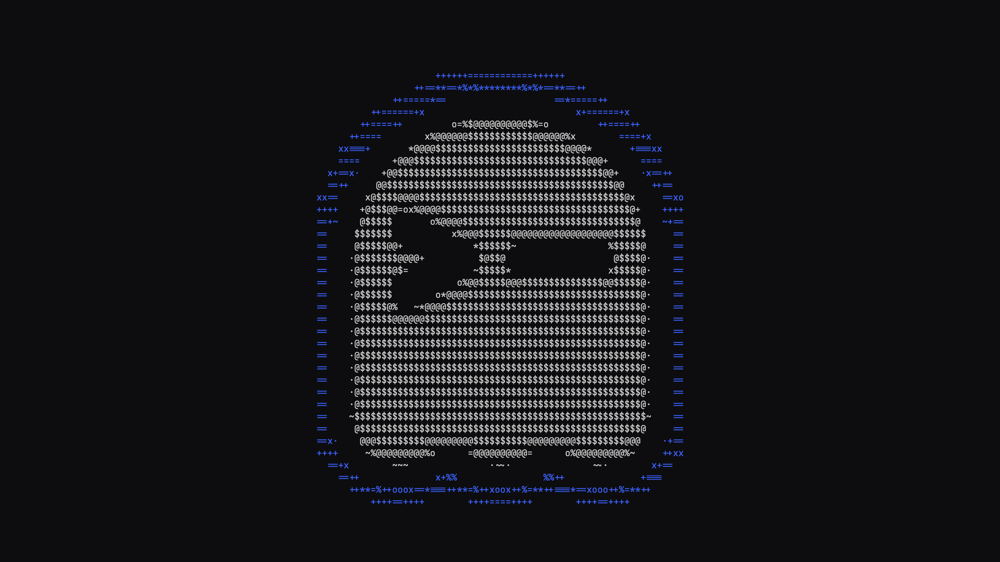
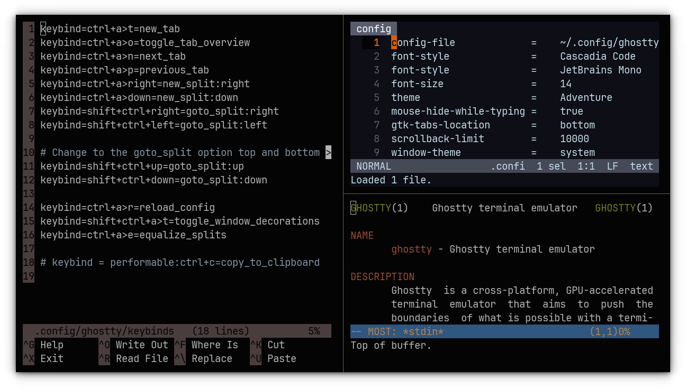
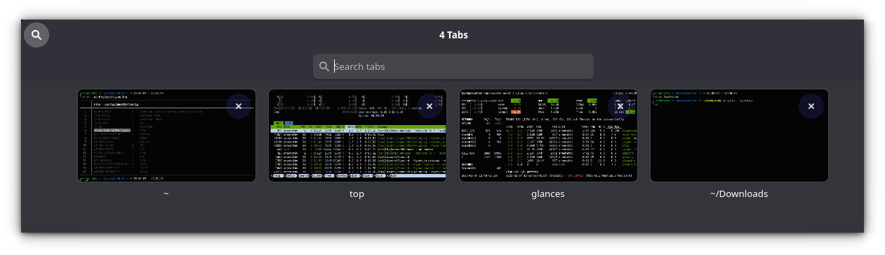
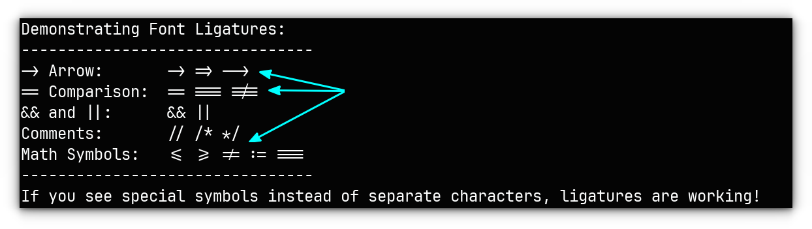
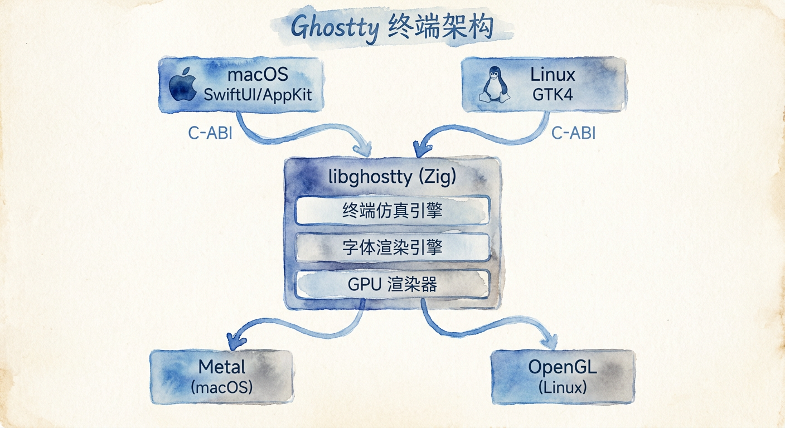
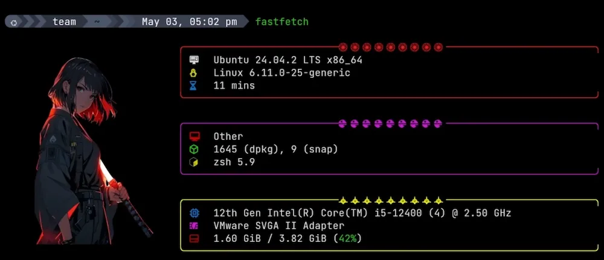
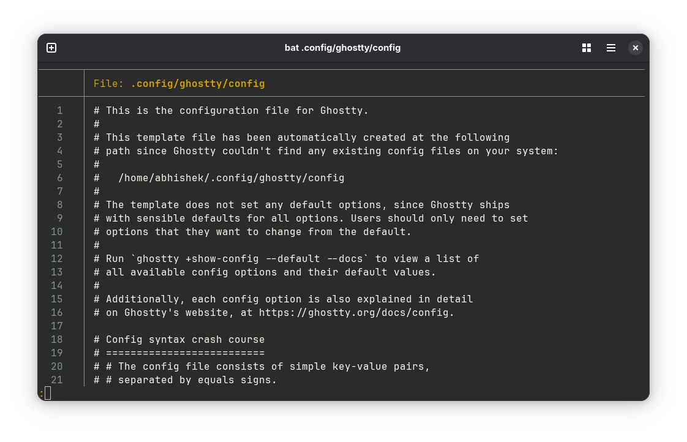

# Ghostty：AI 时代的最强终端，没有之一



> 如果你每天有一半的工作时间都泡在终端里，那么你用的那款终端模拟器很可能是你整个开发环境中最被忽视的性能瓶颈。

先列几个数字：DOOM fire 动画渲染 480 FPS，Terminal.app 不到 10；吞吐量是 iTerm2 的三倍；从零开始用 Zig 手写的渲染管线，每一帧都在 GPU 上完成——连字体连字（ligature）也不例外。2024 年底发布，GitHub 上迅速突破 40,000 颗星。这可不是又一个 Electron 套壳。





在 AI 编码 Agent 遍地开花的今天，Claude Code、Codex、Grok Build 这些工具的输出速度越来越快，终端的渲染瓶颈已经成了 AI 工作流里最直接的卡顿来源。想象一下：Agent 一口气吐出 200 行代码，而你的终端花了半秒才把字画完。Ghostty 做的事情，就是把"终端渲染跟不上 AI 思考速度"这个问题，从根源上给解决了。

分屏、标签页、原生窗口控件、字体连字、图像协议、GPU 加速，这些通常分布在三四款不同终端里的特性，它全塞进了一个不到 10MB 的二进制文件里。而且不是粗糙地堆在一起——每一个功能都经过了 Mitchell Hashimoto 级别的工程洁癖打磨。

下面聊聊这个终端到底是怎么做出来的，以及为什么它在 2025-2026 这个 AI 工具爆发的节点上，恰好出现在了最需要它的时刻。

## 起因：一个"本不打算发布"的项目

Mitchell Hashimoto 这个名字对基础设施领域的人来说不陌生。他是 HashiCorp 的联合创始人，也是 Vagrant、Packer、Consul 等工具的共同作者。2021 年离开 HashiCorp 后，他需要一个副项目来填补时间——一个可以学习 Zig 语言、玩图形编程、深入了解终端内部的沙盒。

他选择终端模拟器的理由很单纯：终端是每个开发者每天用上数小时的工具，但它内部的复杂性被严重低估了。"我有时开玩笑说，Ghostty 70% 是一个字体渲染引擎，30% 才是一个终端模拟器，"他在一次访谈中谈到，"字体渲染和键盘输入编码是两块难啃的骨头，前者决定了你眼睛的感受，后者决定了你手指的感受。"



项目最初没有任何公开计划。Mitchell 在 2022 年开始用 Zig 写原型，当时只是一个纯 GLFW 窗口上的终端，跑在 X11 上，没有标签页、没有分屏、没有 macOS 支持。但随着对终端实现理解的加深，他开始注意到一个模式：市面上的终端模拟器似乎总是让用户在三个维度之间做取舍。

## 不可能三角：快、功能多、原生体验

Mitchell 在他 2024 年 10 月的博客文章《Ghostty is Coming》里用了一张简洁的表格来说明问题。这张表把主流终端模拟器归类到三个属性的维度上：速度快、功能丰富、平台原生 GUI。按照他的评估：

- **Alacritty**：快，原生（用的是平台窗口），但功能极少 -- 连标签页和分屏都没有，主张这些应该交给 tmux 处理。
- **Kitty**：快，功能极其丰富，但 GUI 层是自绘的，标签页和分屏用的是自定义 widget，在 macOS 上尤其显得格格不入。
- **iTerm2**：功能丰富，macOS 原生体验做到了极致，但渲染性能在 GPU 加速的同行面前相形见绌（CPU 渲染，开启 ligature 后尤其明显）。
- **WezTerm**：在三个方向上都有不错的得分，但每个方向都差了一点点 -- GUI 不完全是原生，虽然作者 Wez Furlong 在跨平台一致性上下了很大功夫。
- **Windows Terminal**：功能丰富，原生 Windows 体验好，但速度不如 GPU 终端，且不跨平台。
- **Terminal.app / GNOME Terminal**：原生体验好，但几乎不具备现代终端的高级功能，性能也远不及 GPU 加速的方案。

Mitchell 的结论是：现有方案最多让你三选二。他的目标是三选三。用他自己的话说："我觉得没有技术障碍阻止我做到这一点。"

这句话值得认真对待。说这话的人写过 Vagrant、Packer 和 Terraform 的核心架构，他对于"什么是可行的工程挑战"和"什么是不可能工程挑战"之间的界限有相当准确的判断力。如果他觉得三选三没有技术障碍，那至少值得看看他是怎么做的。

## 设计哲学：Native 的真正含义

Ghostty 的"原生"不是一句营销用语。它意味着三件具体的事：

**第一，使用平台真正的 GUI 组件。**在 macOS 上，Ghostty 的 GUI 用 Swift 编写，直接调用 AppKit 和 SwiftUI，标签页是 NSTabView，分屏是 NSSplitView，菜单栏是原生的 NSMenu，设置窗口是 SwiftUI Form。在 Linux 上，GUI 用 Zig 编写，调用 GTK4 C API（1.2 之后强制依赖 libadwaita），窗口是 GtkWindow，标签页是 GtkNotebook。所有这些都不是在终端表面用字符画出来的。

**第二，遵循平台的交互惯例。**macOS 版的键盘快捷键默认用 Cmd 修饰键，Linux 版默认用 Ctrl。macOS 版支持 Quick Look 预览、Force Touch、Secure Input API、系统原生窗口状态恢复、AppleScript 和 Shortcuts 集成。Linux 版集成 systemd 用于单实例管理、cgroup 隔离、D-Bus 通知。Ghostty 1.1 引入了 Server-Side Decorations 支持，让它在非 GNOME 桌面环境（如 KDE、Sway）下也能正确绘制窗口边框。

**第三，零配置即可使用的默认值。**Ghostty 不强制要求配置文件，不要求你学习任何配置语法。打开就能用。如果默认字体支持 Nerd Font 的图标字符，Starship prompt 开箱即显示正确。它内置了数百套主题（来自 iTerm2-Color-Schemes），用一行 `theme = Adventure` 就能切换。更妙的是支持自动跟随系统深色/浅色模式切换主题：`theme = dark:Moonkai Pro Machine,light:Catppuccin Latte`。

这种设计哲学在终端模拟器领域相当罕见。大多数快速终端（Alacritty、Kitty）选择用跨平台的单一渲染层，GUI 组件要么不做（交给外部工具），要么自己绘制。这样做的好处是代码可控、跨平台一致性好；代价是它们看起来永远不像"属于这个系统"的应用。

## 技术架构：libghostty 与编译期多态

Ghostty 的架构可以用一句话概括：**一个用 Zig 编写的核心库（libghostty），加上针对每个平台量身定制的 GUI 外壳。**



```
+------------------+     +------------------+
|   macOS App      |     |   Linux App      |
|   Swift + AppKit  |     |   Zig + GTK4     |
|   + SwiftUI       |     |   + libadwaita   |
+--------+----------+     +--------+---------+
         |                         |
         |    C-ABI / Zig API     |
         +----------+--------------+
                    |
            +-------v--------+
            |   libghostty    |
            |   (Zig Core)    |
            |                 |
            | - 终端仿真引擎  |
            | - 字体渲染引擎  |
            | - GPU 渲染器    |
            | - 事件循环      |
            +-------+--------+
                    |
         +----------+-------------+
         |                        |
+--------v--------+     +--------v--------+
|   Metal GPU     |     |   OpenGL GPU    |
|   (macOS)       |     |   (Linux)       |
+-----------------+     +-----------------+
```

核心层（libghostty）负责所有与平台无关的逻辑：终端仿真状态机、VT 解析器、字体塑形（harfbuzz）、GPU 渲染管线。它对外暴露 Zig 原生 API 和 C-ABI 兼容接口。macOS 应用以静态库形式链入 libghostty，通过 C API 调用；Linux 应用由于 GTK apprt 也用 Zig 写，直接编译为同一编译单元。

这种架构有几点值得展开说明。

### 多线程设计：IO 与渲染分离

每个终端表面（surface）运行三个线程：

1. **IO 线程**：创建 pty 文件描述符，运行 shell 进程，负责读写 pty、处理终端事件和转义序列。这是输入/输出的核心路径，使用了 SIMD 优化的 VT 解析器。
2. **渲染线程**：将终端状态转换为像素，以固定帧率绘制。负责字体塑形和 GPU 渲染调度。
3. **写入线程**：处理从应用程序到 pty 的写入操作。

这套设计的关键好处是：IO 线程从不被渲染阻塞。即使你在渲染一个 4K 全屏的终端，输入响应也不会受到影响。Mitchell 在 2025 年 11 月的一次重构中（将 Screen.clone 替换为 RenderState），把渲染器持有终端锁的临界区时间缩短了 2 到 5 倍，约一半的帧中临界区时间为零微秒 -- 这意味着 IO 线程在这个时间段内完全不受干扰。

### Comptime 接口：零开销的平台抽象

Zig 的 `comptime`（编译期求值）在 Ghostty 中被用作实现平台抽象的主要手段。比如字体渲染在 macOS 上使用 CoreText，在 Linux 上使用 Fontconfig + Freetype + Harfbuzz。Ghostty 用 comptime 接口来声明这个抽象的 API，然后在编译期根据目标平台选择具体实现。

这样做的好处是：所有函数分发在编译期完成，运行时零开销。没有虚函数表，没有动态分派，没有条件分支。对于终端模拟器这种性能敏感的应用来说，每一个 CPU 周期都很重要 -- 尤其是当你试图以 120fps 的速率渲染 200 行 x 80 列的文本网格时。

Mitchell 在 2023 年一场名为"Introducing Ghostty and Some Useful Zig Patterns"的演讲中详细介绍了这个模式。他还展示了另一个巧妙的用法：使用 comptime 枚举和位域来紧凑表示终端的各种模式（mode）状态，将数百个布尔标志压缩到最小空间。

### GPU 渲染：Metal 与 OpenGL 双后端

Ghostty 在 macOS 上用 Metal，Linux 上用 OpenGL。这不是简单的"调一下 GPU 加速"，而是针对终端渲染场景做了专门优化。

根据 GitHub README 的声明，Ghostty 是除 iTerm2 之外，唯一一个直接使用 Metal 渲染的终端模拟器。而且它在这一点上还要更进一步：iTerm2 在启用 ligature 时回退到 CPU 渲染，Ghostty 则全程保持 GPU 加速。这意味着你可以在享用 Fira Code 或 JetBrains Mono 的连字效果的同时，不牺牲任何渲染性能。

渲染器使用了纹理图集来缓存字形，避免每帧重新光栅化字形。字体塑形由 Harfbuzz 处理，然后结果被上传到 GPU 纹理并缓存在显存中。当终端的文本内容变化时，只有变化的单元格需要更新纹理图集，这就是为什么 RenderState 的 dirty tracking 如此关键 -- 它是整个渲染管线的性能基石。

## 性能：在"快"的赛道上站稳

Ghostty 不声称自己是最快的终端模拟器，但它有底气说自己属于"快"的那一档。Mitchell 在他的演讲里放出了一段经典的 DOOM fire 动画测试：Ghostty 在播放这个会同时修改大量单元格并持续滚动的动画时，帧率维持在 480 到 500 FPS。同样的动画在 macOS 自带的 Terminal.app 上只有不到 10 FPS。Alacritty 和 Kitty 在这个测试中的表现与 Ghostty 在同一量级。

在日常使用场景中，Ghostty 的快更多体现在"流畅感"上，而不是纯粹的吞吐量数字。滚动浏览大量的终端历史输出时没有卡顿，通过 Neovim 在大文件中快速移动光标时没有撕裂感，字形的渲染精度与原生文本编辑器无异。

性能对比方面，以下是一些公开发表的测试数据总结：

| 终端模拟器 | 渲染后端 | 原生 GUI | Ligature 支持 | 图片协议 | 输入延迟 | 内存占用 |
|-----------|---------|---------|-------------|---------|---------|---------|
| Ghostty 1.3 | Metal/OpenGL | SwiftUI / GTK4 | GPU 加速 | Kitty 协议 | 低（多线程 IO） | 中等（动态 scrollback） |
| Alacritty 0.14 | OpenGL | 平台窗口 | 有限支持 | 无 | 低 | 低 |
| Kitty 0.39 | OpenGL | 自绘 UI | CPU 渲染 | Kitty 协议 | 低 | 较高（GPU 缓存） |
| WezTerm | OpenGL/Metal | 自绘 GUI | 支持 | Kitty + Sixel | 中等 | 中等 |
| iTerm2 3.5 | Metal/CPU | AppKit | CPU（回退） | inline image | 较低 | 较高 |
| Terminal.app | CPU | AppKit | 无 | 无 | 中等 | 低 |

几个值得注意的数据点：

- **吞吐量**：根据独立测评，Ghostty 的原始输出吞吐量约为 iTerm2 的 3 倍，约为 Warp 的 2.5 倍。在 cat 一个 10,000 行文件这类场景下差异尤为明显。
- **输入延迟**：有社区基准测试（moktavizen/terminal-benchmarks）显示早期版本（约 11 个月前）的 Ghostty 输入延迟在各竞品中最差。不过这个测试的版本较早，而且 Mitchell 在后续的 release notes 中多次提到输入路径的优化。
- **滚动流畅度**：这可能是 Ghostty 在实际使用中最能被感知的性能优势。GPU 渲染 + 独立渲染线程 + 帧同步（synchronized output）协议支持的组合让滚动体验非常平滑。

值得注意的是，LWN.net 的编辑在 Fedora 上用 cat 一个超长文件做了一次非科学基准测试：Ghostty 用了 7.56 秒，Konsole 1.031 秒（这里可能有配置差异），iTerm2 7.75 秒，Alacritty 6.93 秒，GNOME Terminal 12.13 秒。这个测试虽然粗糙，但大致印证了一个模式：GPU 加速的终端在原始吞吐量上明显优于传统方案，而它们之间的差距在多数场景下并不显著。

## 功能矩阵：不只是"又一个终端"

### 窗口管理：标签页、分屏、概览

Ghostty 的多窗口管理走的是"够用且美观"路线。它支持多窗口（每个都是真正的系统窗口）、标签页、分屏（水平和垂直）。每个标签页会以最近执行过的命令自动命名，你可以对标签页进行重命名和着色。


标签页概览模式（toggle_tab_overview）提供类似 GNOME Overview 的视图，列出所有打开的标签页并支持搜索。对于同时开着十几个标签页的人来说，这个功能相当实用。


### 键盘快捷键与触发序列

Ghostty 1.2 引入了"可执行快捷键"（performable keybinding）机制。这个概念很简单但很实用：同一个组合键在不同上下文中执行不同的动作。最经典的例子：

```
keybind = performable:ctrl+c=copy_to_clipboard
```

当你选中了文本时，Ctrl+C 执行复制；没有选中时，Ctrl+C 正常发送 SIGINT。这彻底解决了"复制文本却误杀了进程"的困扰。

1.3 版本更进一步，引入了 Key Tables（键表）机制，支持模态快捷键工作流。你可以定义一组键表，在运行时动态切换，实现类似于 Vim 的多模式操作。

### 终端特性：标准合规与现代化

在终端标准合规方面，Ghostty 的策略分三级：(1) 如果有标准定义，遵循标准（ECMA-48）；(2) 如果没有标准，跟随 xterm 的行为（因为它是事实上的参考实现）；(3) 如果 xterm 也没有定义，参考其他主流终端的做法。

Ghostty 支持的现代终端特性包括：

- **Kitty 键盘协议**：允许应用程序接收比传统终端更丰富的键盘事件，比如区分 Ctrl+I 和 Tab。
- **Kitty 图形协议**：允许在终端内嵌显示图片。配合 yazi 文件管理器可以直接在终端里预览图片和 PDF。
- **styled underlines**：支持波浪线、虚线、双线等多种下划线样式。
- **synchronized output**：支持帧同步输出，消除终端刷新过程中的撕裂和闪烁。
- **OSC 52 剪贴板操作**：允许远程 SSH 会话访问本地剪贴板。
- **桌面通知（OSC 9）**：终端应用可以直接发送系统桌面通知。



### Shell 集成

Ghostty 提供了一套 shell 集成脚本（bash、zsh、fish、elvish），安装后可以获得：

- 自动设置工作目录（OSC 7），让新建标签页自动定位到当前目录
- 语义化提示（OSC 133），支持点击移动光标到 shell 提示符内
- 命令完成后的桌面通知（1.3 新增）
- 进度条显示（OSC 9;4，1.3 新增）

## 与各竞品的直接对比

与其罗列特性清单，不如用场景来比较。

**如果你用的是 Tiling Window Manager（如 i3、Sway、Awesome）：**

Alacritty 的极简哲学在这里有天然优势 -- 你本来就不需要标签页和分屏，窗口管理器就是你的窗口管理器。但 Ghostty 的优势在于：你可以通过 `window-decoration = none` 去除所有窗口装饰，用 `gtk-titlebar = false` 隐藏标题栏，同时仍然享受 ligature、Kitty 图形协议、shell 集成等 Alacritty 不具备的功能。

**如果你在 macOS 上做开发：**

这个场景下 Ghostty 几乎没有对手。iTerm2 虽然功能丰富且 macOS 集成度高，但性能差距明显（尤其是开启 ligature 后回退到 CPU 渲染）。Kitty 的功能确实强大，但自绘的 UI 在 macOS 上永远像是一个移植过来的 Linux 应用。Ghostty 的 SwiftUI 应用从窗口管理到菜单栏到 Quick Look 都像是苹果写的。

**如果你重度使用终端内的图片显示：**

Kitty 仍然是这个领域的标杆 -- 毕竟图形协议是它发明的。Ghostty 实现了同样的协议，功能完整但在边缘 case 上不如 Kitty 成熟。WezTerm 支持 Kitty 协议加 Sixel 协议，覆盖范围更广但实现质量参差不齐。

**如果你需要跨平台（含 Windows）：**

Ghostty 目前没有 Windows 支持。Windows 支持在项目路线图的第 7 步（一共 7 步），目前没有明确的时间表。如果你需要在 Windows 上工作，WezTerm 或 Windows Terminal 是更现实的选择。

**如果你想要"开箱即用"的体验：**

这是 Ghostty 最突出的优势之一。下载、打开、开始工作。不需要写配置文件，不需要安装额外的字体，不需要调试 GPU 驱动问题。它的默认值经过了上千人的内测验证，覆盖了绝大多数开发者的日常需求。



## 安装与配置

### macOS

```bash
# Homebrew（社区维护）
brew install --cask ghostty

# 或者从 ghostty.org/download 下载 DMG 直接安装
```

系统要求：macOS 13 Ventura 或更高（Ghostty 1.4 将提升至 macOS 14）。

### Linux

```bash
# Arch Linux（官方仓库）
sudo pacman -S ghostty

# Ubuntu/Debian（非官方仓库，由社区维护）
# 从 https://github.com/ghostty-org/ghostty/releases 下载 .deb

# Nix
nix profile install nixpkgs#ghostty  # 或 ghostty-bin for macOS 二进制包
```

Linux 要求：GTK 4.14+ 且 libadwaita 1.5+。

### 基本配置

配置文件位于 `~/.config/ghostty/config`（Linux）或 `~/Library/Application Support/com.mitchellh.ghostty/config`（macOS），格式为简单的键值对：

```
# 字体设置
font-family = JetBrains Mono
font-size = 13

# 主题
theme = catppuccin-mocha

# 窗口设置
window-padding-x = 8
window-padding-y = 4
background-opacity = 0.95

# 快捷键
keybind = super+d=new_split:right
keybind = super+shift+d=new_split:down
```

查看所有可用的配置项和文档说明：

```bash
ghostty +show-config --default --docs | less
```

列出所有内置主题（带实时预览）：

```bash
ghostty +list-themes
```

## 开源治理与非盈利转向

2025 年，Ghostty 项目的版权和资产转移到了 Hack Club 的 501(c)(3) 非盈利组织下。这意味着 Ghostty 在法律上不属于任何商业实体，而是由一个以青少年编程教育为使命的非盈利组织托管。

这一举措的意义在于：即使 Mitchell 个人未来减少参与或改变方向，Ghostty 也不会因为核心作者的变动而陷入停滞。Hack Club 的托管机制确保项目始终保持开源、社区驱动。对于一个正在成为部分开发者日常基础设施的项目来说，这种长期保障比任何 feature 都重要。

## 局限与不足

Ghostty 并非完美。以下几个方面的不足值得了解：

**没有 GUI 设置界面（Linux）。**macOS 版有一个 SwiftUI 设置窗口，但 Linux 版目前只能通过文本配置文件调整设置。虽然配置语法简单，文档完善，但对于习惯了 GUI 设置的用户来说仍然是一道门槛。1.4 版本计划为 Linux 版添加图形化设置。

**没有 Windows 支持。**项目 roadmap 上排在最后一步。考虑到 Ghostty 的架构严重依赖平台原生 GUI（Metal/SwiftUI 或 GTK4），Windows 版的实现意味着要么等待 Zig 生态的 Windows GUI 方案成熟，要么再写一套 WinUI 的应用层。

**字体渲染在某些配置下存在问题。**有用户反映 Ghostty 对 PragmataPro 等特定字体的渲染宽度与其他终端不一致。这类问题通常与 Ghostty 自定义的字体度量计算逻辑有关，社区在持续修复中。

**内存使用不是最优。**Mitchell 本人坦承，他在 CPU 和渲染性能上花了大量精力，但在内存优化上比较"松散"。早期版本预分配了整个 scrollback buffer（几 MB），后续版本改为了动态分配。

**生态还不够成熟。**比起 iTerm2 十几年的插件积累和 Kitty 的用户社区，Ghostty 的第三方工具和集成仍在早期阶段。不过随着 libghostty 的独立发布（1.3 开发周期中已成功提取为独立 Zig 模块），基于它的嵌入式终端和衍生项目正在快速增加。

## libghostty：终端模拟器的"Chromium 时刻"？

Ghostty 最激进的规划不在于桌面应用本身，而在于 libghostty。这个 C-ABI 兼容的核心库包含了完整的终端仿真逻辑、字体渲染和 GPU 渲染能力。理论上，任何语言只要能调用 C API，就可以基于 libghostty 构建一个终端模拟器应用。

Mitchell 的远期愿景是让 libghostty 成为终端模拟器领域的"Chromium"（或更准确地说，Blink 渲染引擎）。开发人员可以专注于构建优秀的应用体验 -- 独特的窗口管理、创新的交互方式、嵌入 IDE 的终端面板、网页终端、新的终端多路复用器 -- 而无需重新实现终端仿真这个极其复杂且容易出错的核心。

这个类比并非空谈。1.3 版本中 libghostty 已被成功提取为独立 Zig 模块，Zig 和 C 的示例代码已经放在 GitHub 上。还有个叫 Ghostling 的 demo 项目，用单个 C 文件配合 Raylib 就实现了一个"最小可用终端"，展示 libghostty 的集成灵活性。

已经有项目开始基于 Ghostty 构建产品：Clauntty（iOS 上的 SSH 终端，使用了 Ghostty 的 Metal 渲染器）、cmux（macOS 原生终端，垂直标签页 + 通知系统 + 可脚本化的浏览器，用于并行运行多个 AI 编程 agent）。

## 结语

Ghostty 的出现，本质上回应的不是一个技术问题，而是一个工程哲学问题：在"快"和"原生"之间，是否必然存在取舍？Mitchell Hashimoto 用两年多的闭门开发和十万行 Zig 代码给出了他的答案：不必然。

它不是什么革命性的东西。它没有发明新的终端协议，没有重新定义人机交互，没有集成 AI 助手。它只是把"快"、"功能多"和"原生体验"这三件事同时做到了一个足够好的水准，让专业用户不再需要被迫选择。

如果说有什么遗憾的话，那就是 Windows 用户暂时还无法体验。但考虑到路线图才走到第 5 步（libghostty 独立），而前 5 步的质量超出了大多数人的预期，Windows 支持的那一天应该不会太远。

对于每天在终端里度过数小时的人来说，Ghostty 值得一试。它是那种"用了就回不去"的工具 -- 不是因为某个单一杀手级 feature，而是因为所有细节叠加起来，让终端这个最常用的开发工具终于不再碍眼。

---

*Ghostty 官网：[ghostty.org](https://ghostty.org) | GitHub：[ghostty-org/ghostty](https://github.com/ghostty-org/ghostty) | 许可证：MIT | 主要语言：Zig (~93%) + Swift (~4%) | 最新稳定版：1.3.1 (2026年3月13日)*
